# PHY4605 Week 01 — Physics to Arrays and Plots

Archived previous linear draft; retained for provenance.

Status: draft for lecturer approval. No sample, slide jobs, final slide images, speaker notes, or replacement PPTX may be created before this outline and its required-image mapping are approved.

Audience: Year-2 physics students with familiar vertical-motion mathematics but uncertain retained MATLAB foundations.

Teaching goal: make `physical model -> variables and units -> arrays -> element-wise operations -> index -> plot -> validation -> physical interpretation` visible and traceable.

Visual style after approval: Codex-PPT Teaching Courseware. Existing slide renders are content-only references, not style references.

## Slide outline

### Slide 1: Physics to Arrays and Plots
- Key points: A familiar vertical-motion model becomes a computational object; connect model, arrays, plot, validation, and interpretation; Week 1 emphasizes reading and tracing rather than blank-page coding.
- Visual idea: Sparse opening with launch, peak, and return states beside the course reasoning chain.
- Layout role and intent: Cover / concept overview; establish the physical story and destination.
- Required images:
  - Current Slide 1 render; strict content-only reference; preserve the title, weekly scope, motion states, and reasoning chain but do not copy the retired layout.

    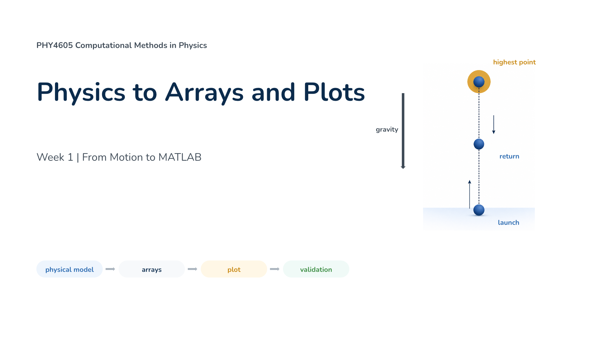
  - Vertical-motion illustration; strict scientific asset; preserve launch, peak, return, gravity direction, and colour mapping.

    

### Slide 2: Start with a physical prediction
- Key points: The ball starts at `y = 0 m`; rises; reaches one maximum; returns toward launch height.
- Visual idea: Three-state prediction sequence before any code appears.
- Layout role and intent: Context / prediction; activate familiar physics before MATLAB.
- Required images:
  - Current Slide 2 render; strict content-only reference; preserve the prediction statements without copying its layout.

    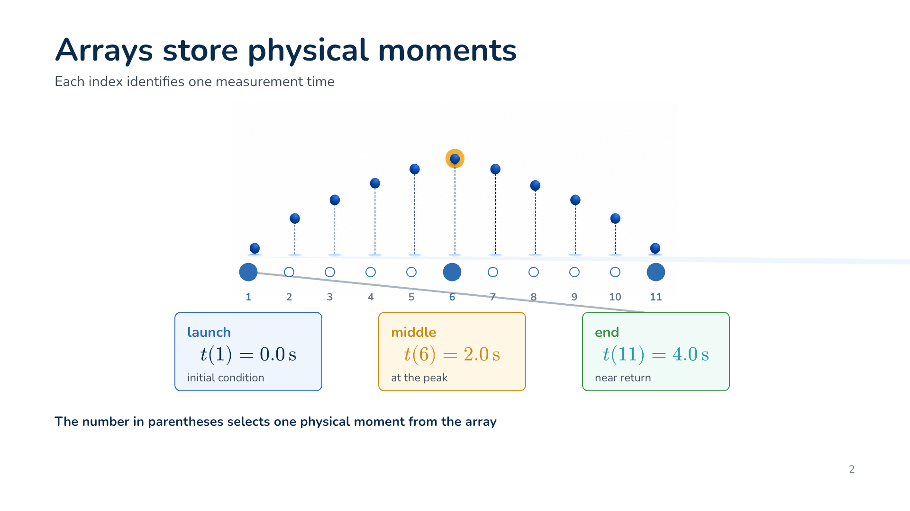
  - Vertical-motion cutaway; strict scientific asset; preserve one-dimensional direction and state mapping.

    

### Slide 3: The equation links each term to motion
- Key points: Use `y(t) = y0 + v0 t - (1/2) g t^2`; identify starting position, upward contribution, and gravity contribution; verify every term has units of metres.
- Visual idea: Exact equation with colour-linked term annotations and a compact trajectory.
- Layout role and intent: Concept explanation / worked model; read the equation before translating it to MATLAB.
- Required images:
  - Current Slide 3 render; strict content-only reference; preserve all term meanings and the unit check.

    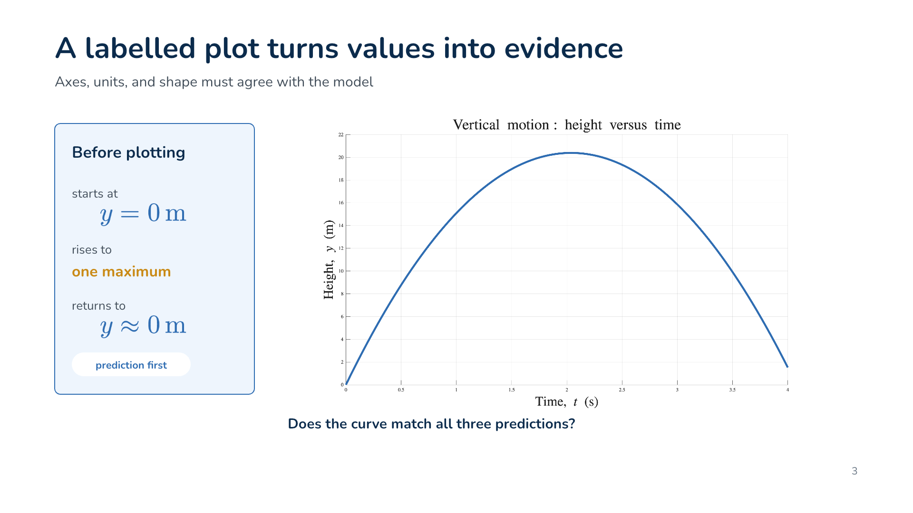
  - Exact position equation; strict mathematical asset; preserve symbols, sign, fraction, superscript, and spacing.

    
  - Supporting vertical-motion diagram; strict scientific asset.

    

### Slide 4: Names and units keep the model readable
- Key points: Translate `t`, `y`, `v0`, and `g` into meaningful MATLAB names; keep units visible; distinguish variables from fixed parameters; use readable names to support checks.
- Visual idea: Physics symbol to meaning to MATLAB name to unit mapping.
- Layout role and intent: Mapping / vocabulary; remove naming ambiguity before code reading.
- Required images:
  - Current Slide 4 render; strict content-only reference; preserve mappings and units.

    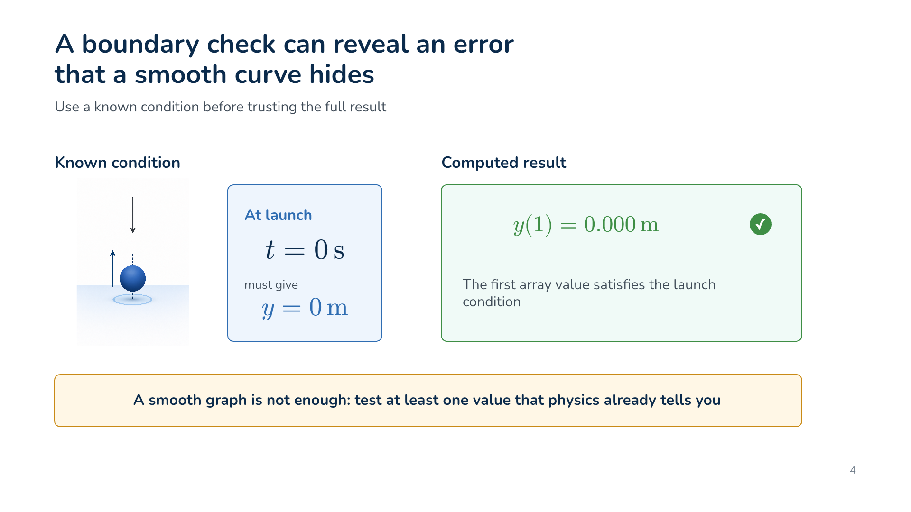
  - Exact symbol assets for `t`, `y`, `v0`, and `g`; preserve subscripts and semantic colours.

    

    

    

    

### Slide 5: Build the time array first
- Key points: `t_s = 0:0.1:4` and `t_s = linspace(0,4,41)` create the same 41-sample plan; `length(t_s)` reports 41; MATLAB indexing begins at 1.
- Visual idea: Two exact code routes beside a sampled time axis.
- Layout role and intent: Worked example / array construction; connect an array to physical sampling.
- Required images:
  - Current Slide 5 render; strict content-only reference; preserve exact code, endpoints, count, and indexing statement.

    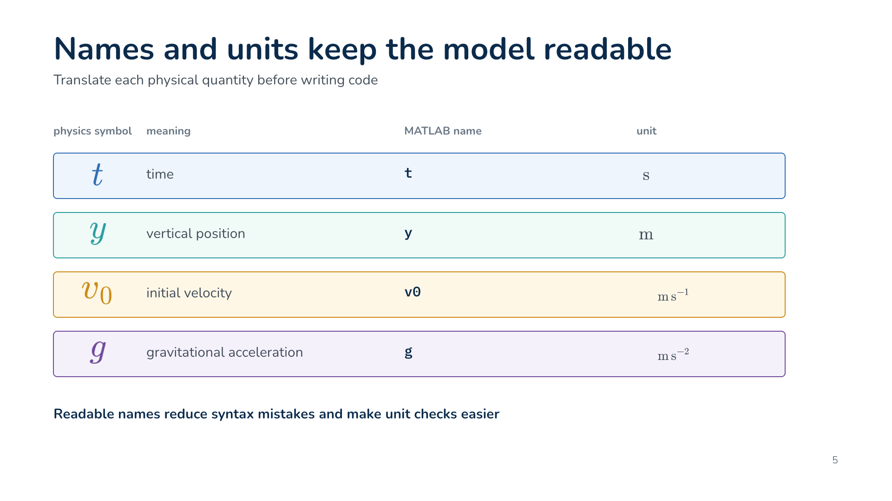

### Slide 6: An index selects one physical moment
- Key points: `t_s(1)` is launch; `t_s(11)` selects `1.0 s`; an index is not a time value; interpret the selected physical state after locating the array position.
- Visual idea: Array-to-trajectory mapping with magnified index callouts.
- Layout role and intent: Guided trace; connect abstract indexing to motion.
- Required images:
  - Current Slide 6 render; strict content-only reference; preserve exact index-to-time examples.

    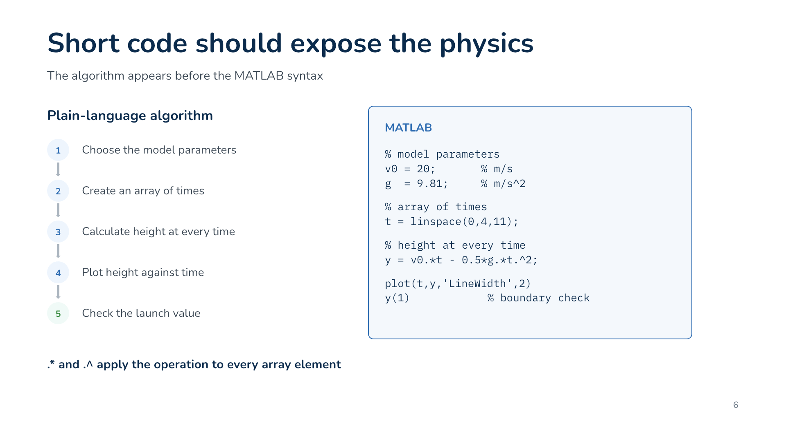
  - Sampled-motion array; strict scientific asset; preserve index-to-time mapping.

    

### Slide 7: Dots tell MATLAB to work through an array
- Key points: `20 * 3` produces one number; `v0_mps .* t_s` produces one value per time; `t_s.^2` squares every stored time; the dots mark element-wise operations.
- Visual idea: Scalar versus element-wise multiplication versus array squaring.
- Layout role and intent: Comparison / misconception repair; isolate the key Week 1 syntax distinction.
- Required images:
  - Current Slide 7 render; strict content-only reference; preserve all MATLAB punctuation and operator meanings. The retired generated Slide 7 is not an approved style or content reference.

    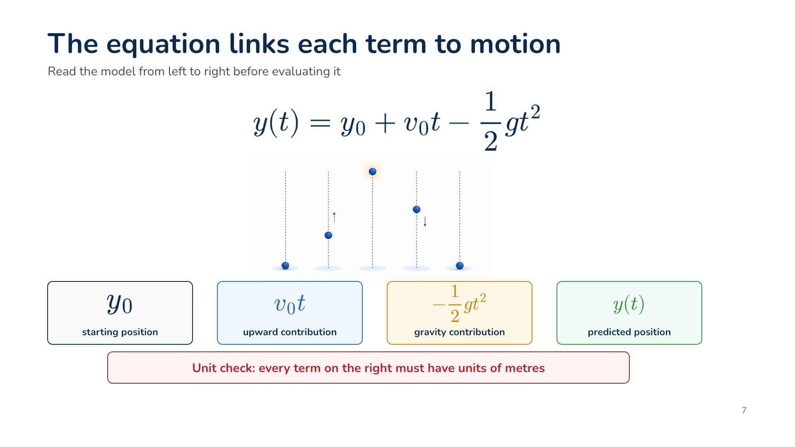

### Slide 8: The algorithm appears before the MATLAB syntax
- Key points: Choose parameters; create the time array; calculate height at every time; plot height against time; check the launch value.
- Visual idea: Five-step model-to-check pathway with plain-language labels.
- Layout role and intent: Process / pseudocode; expose the ordered reasoning before code.
- Required images:
  - Current Slide 8 render; strict content-only reference; preserve the five-step algorithm order.

    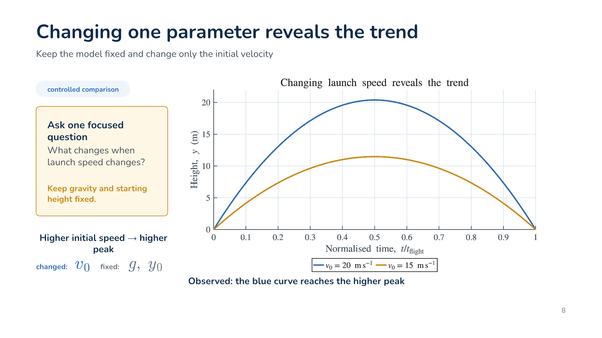

### Slide 9: Short code should expose the physics
- Key points: Read comments and names first; locate parameters and array construction; trace `.*` and `.^`; locate the plot and boundary check.
- Visual idea: Large exact MATLAB fragment with five trace markers.
- Layout role and intent: Code reading / guided trace; support runnable-code comprehension.
- Required images:
  - Current Slide 9 render; strict content-only reference; preserve the exact code and trace mapping.

    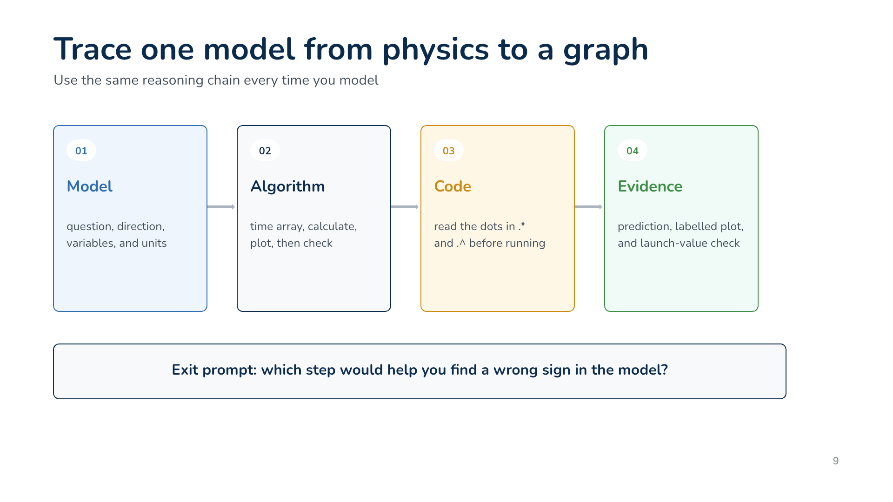

### Slide 10: A labelled plot turns values into evidence
- Key points: The curve starts at `y = 0 m`; rises to one maximum; falls toward launch height; labels, units, and title make the output interpretable.
- Visual idea: Large MATLAB plot with three prediction-to-curve connections.
- Layout role and intent: Data evidence / interpretation; make the graph answer the physical question.
- Required images:
  - Current Slide 10 render; strict content-only reference; preserve interpretation statements.

    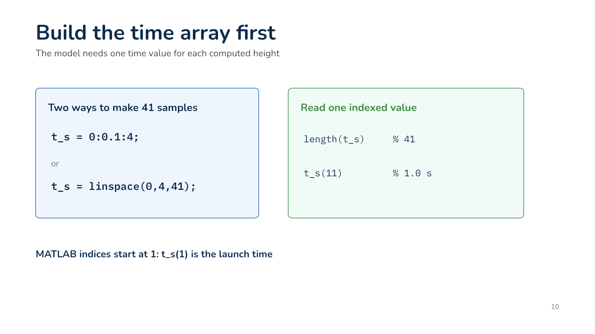
  - MATLAB height-time plot; strict data asset; preserve data, axes, labels, units, curve, and values without redraw.

    

### Slide 11: A boundary check can reveal an error that a smooth curve hides
- Key points: The known condition is `y(0) = 0 m`; one-based storage makes this `y_m(1)`; `assert(abs(y_m(1)) < 1e-12)` makes the check executable; a smooth graph alone is insufficient.
- Visual idea: Launch condition connected to the computed first value and a passing executable check.
- Layout role and intent: Validation; model minimum trustworthy evidence.
- Required images:
  - Current Slide 11 render; strict content-only reference; preserve the exact assertion and validation meaning.

    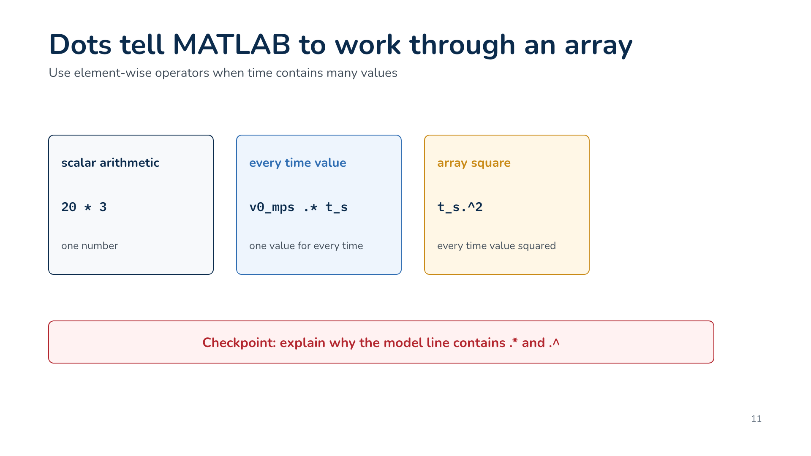
  - Launch boundary illustration and exact expressions; strict assets.

    

    

    

### Slide 12: Trace one model from physics to a graph
- Key points: Model means question, direction, variables, and units; algorithm means sample, calculate, plot, and check; code means reading `.*` and `.^`; evidence means prediction, labelled plot, and launch check.
- Visual idea: Four-stage synthesis chain with a wrong-sign diagnostic prompt.
- Layout role and intent: Synthesis / transfer; consolidate the reusable course method.
- Required images:
  - Current Slide 12 render; strict content-only reference; preserve the chain and diagnostic question.

    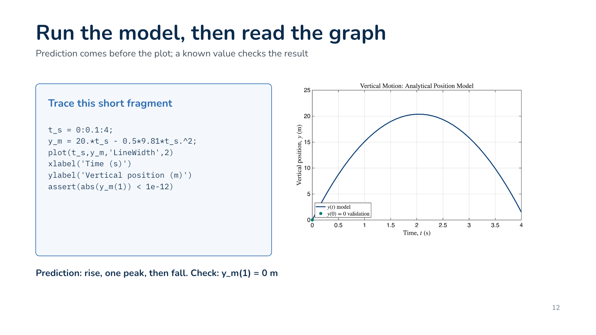

### Slide 13: Week 1 exit ticket
- Key points: Name the output variable and unit; explain `t_s(11)`; identify the array-squaring operator; state one graph prediction and one value check.
- Visual idea: Four spacious response prompts and a Week 2 bridge.
- Layout role and intent: Summary / reflection; create an individual checkpoint without answers.
- Required images:
  - Current Slide 13 render; strict content-only reference; preserve the four prompts and do not reveal answers.

    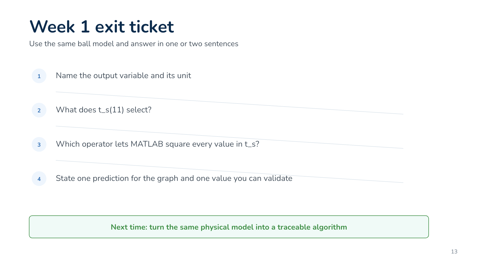

## Approval checkpoint

Approval confirms the 13-slide sequence and every source-slide, equation, illustration, and MATLAB-plot mapping above. No downstream Codex-PPT artefact exists in this fresh project yet.
