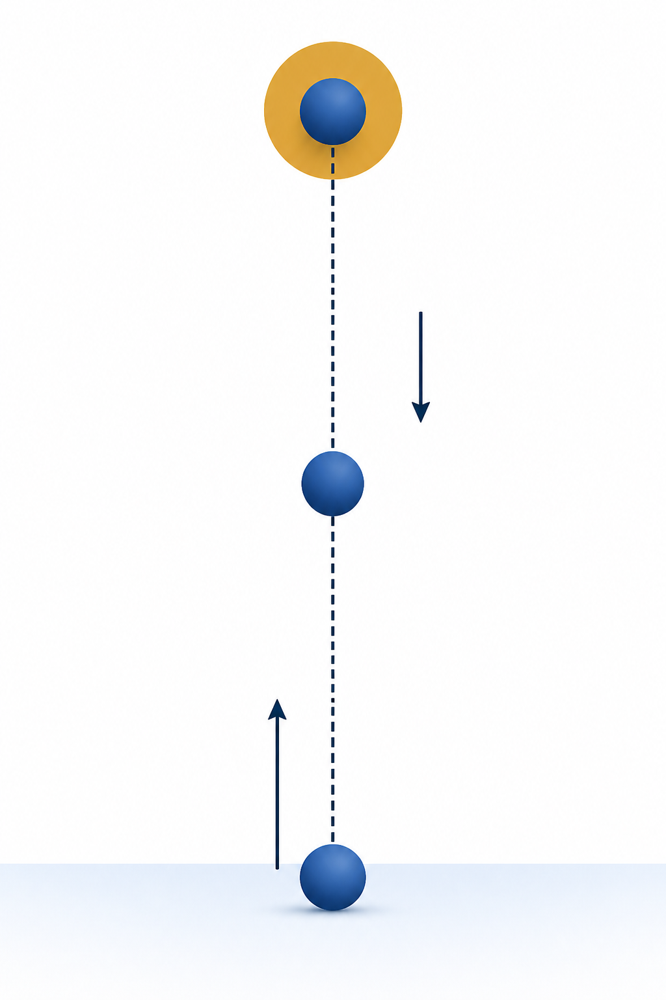
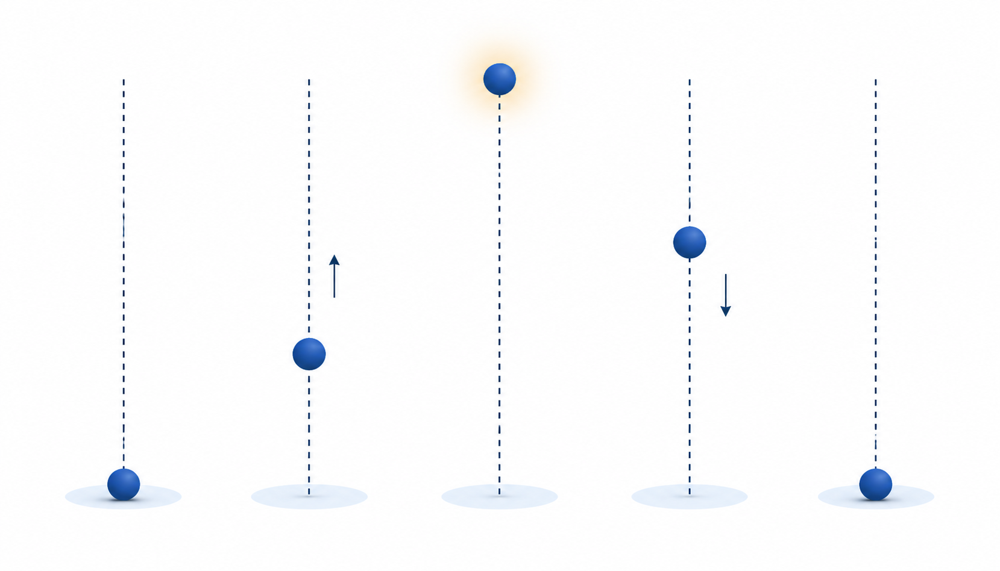
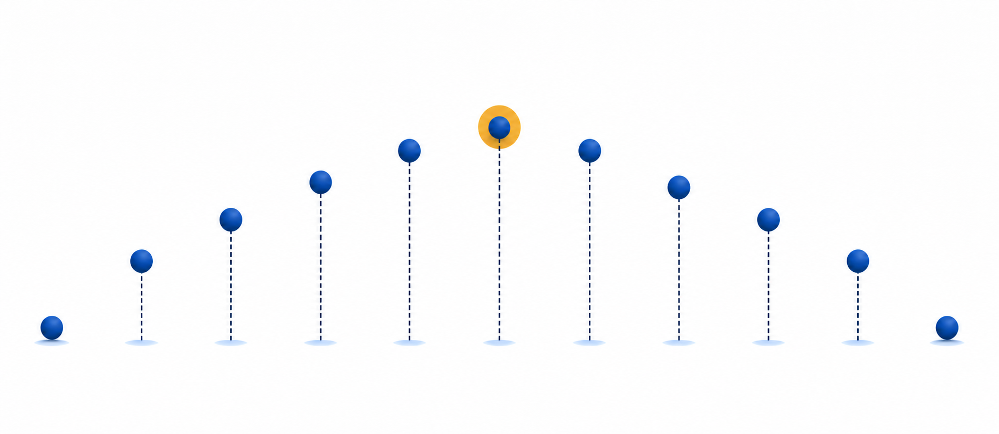
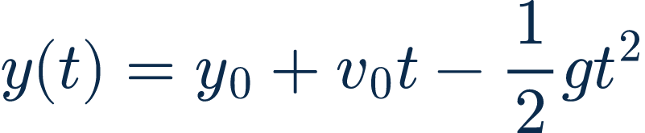
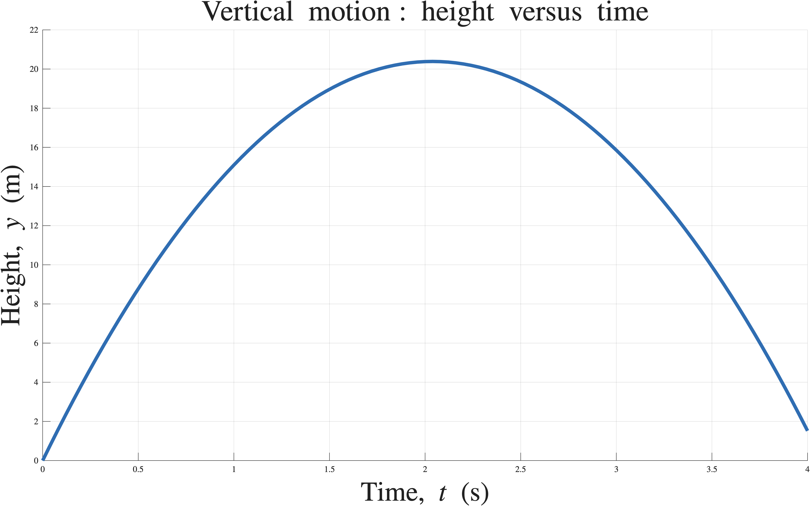
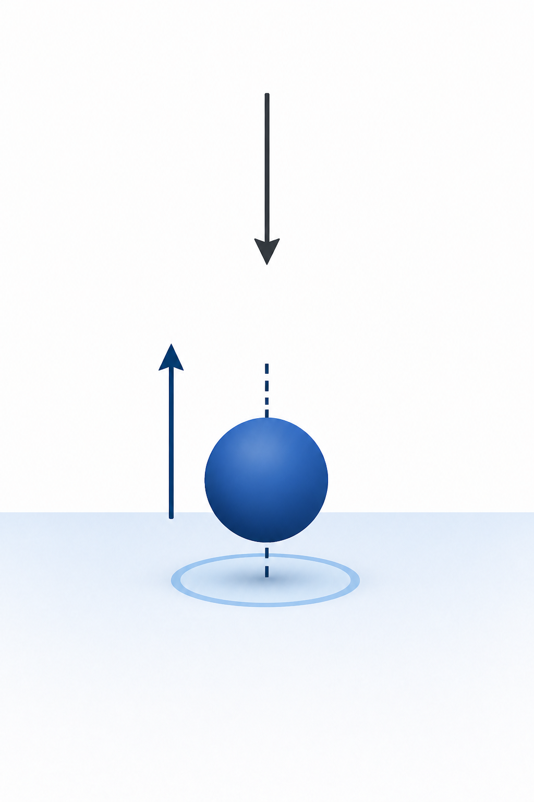

# PHY4605 Week 01 — Physics to Arrays and Plots

Status: outline, asset mapping, visual direction, and representative sample approved on 2026-09-02. The revised narrative is intentionally different from the earlier linear draft while retaining the Week 01 blueprint scope and the locked vertical-motion model.

Audience: Year-2 physics students with familiar vertical-motion mathematics but uncertain retained MATLAB foundations.

Teaching goal: make the chain physical question -> prediction -> sampled representation -> array operation -> algorithm -> MATLAB evidence -> validation -> interpretation visible and reusable.

Visual style: Codex-PPT Teaching Courseware, using the selected **Muted Academic Blue + Sage** direction. Keep the approved typography and vary text weight deliberately: bold for main titles only, semibold for short headings or key labels, and regular for explanatory copy, bullets, and sublabels. Use deep navy and dusty blue for the physical model and important structure, quiet sage for expected or validated states, muted ochre for occasional prompts or warnings, and subdued coral only for a real defect or failure. Ochre/yellow is an optional sparse accent, not a required slide element: avoid a repeated oversized prompt box, and prefer a compact inline prompt, small marker, or no prompt when the teaching point does not need one. Use moderate information density with short supporting phrases, direct labels on diagrams, and brief explanatory callouts. Do not reuse the previous slide renders as a visual template or required source asset.

## Slide outline

### Slide 1: Physics to Arrays and Plots
- Key points: Ask how a familiar physics formula becomes computational evidence; introduce the path from prediction to plot; frame Week 1 as a model-reading and evidence-building lesson.
- Visual idea: A sparse vertical-launch scene with three physical states and a small preview of the eventual height-time curve.
- Layout role and intent: Cover / driving question; establish the story without presenting a syllabus list.
- Required images:
  - Vertical-motion illustration; strict scientific asset; preserve launch, peak, return direction, gravity arrow, and colour meaning.

    

### Slide 2: Before MATLAB, sketch what must happen
- Key points: The ball starts at y = 0 m; it rises while the upward velocity contribution dominates; it reaches one maximum; it falls toward the launch height.
- Visual idea: Three large labelled states across the motion sequence, with a compact prediction panel at right. Use blue for the motion illustration and a restrained sage accent for the check state; remove the colour legend/key entirely so the labels carry the meaning.
- Layout role and intent: Prediction / physical intuition; activate the known model before introducing arrays or syntax.
- Required images:
  - Vertical-motion cutaway; strict scientific asset; preserve one-dimensional motion and the state mapping.

    

### Slide 3: Decide what the computer must remember
- Key points: Scalars store fixed values such as y0, v0, and g; an array stores many chosen times; the output array stores one position for each time; every stored quantity needs a meaning and unit.
- Visual idea: A physical quantity -> MATLAB name -> storage form -> unit mapping, with scalar and array cards side by side.
- Layout role and intent: Concept mapping / vocabulary; make variables, parameters, outputs, and units concrete before code.
- Required images: None. Use exact source values and names from the Week 01 Live Script as strict text inputs.

### Slide 4: Sampling is a choice, not the motion itself
- Key points: t_s = 0:0.1:4 and linspace(0,4,41) describe the same 41-sample plan; the continuous model is represented by selected times; sampling density changes what can be seen, not the underlying equation.
- Visual idea: One continuous trajectory with a small, clear set of highlighted time samples and two equivalent array-construction cards.
- Layout role and intent: Worked example / discretisation; connect arrays to physical measurement moments without adding numerical-method theory.
- Required images:
  - Sampled-motion array illustration; strict scientific asset; preserve the index-to-time relationship and physical state mapping.

    

### Slide 5: One index represents one physical moment
- Key points: t_s(1) is the launch time; t_s(11) selects 1.0 s; an index is a storage location, not a time value; interpretation begins only after mapping the index back to a physical quantity.
- Visual idea: A zoomed array-to-trajectory mapping with t_s(1), t_s(11), and the corresponding points highlighted.
- Layout role and intent: Guided trace / indexing repair; turn one-based indexing into a physical interpretation skill.
- Required images: None. Use the exact array values and indexing expressions from the Week 01 Live Script as strict text inputs.

### Slide 6: Make one equation work for many times
- Key points: Start from y(t) = y0 + v0 t - (1/2) g t^2; identify the starting-position, launch, and gravity contributions; calculate one position for each stored time; check that each term has units of metres.
- Visual idea: Exact equation at the centre with three colour-linked term explanations and a small array output preview.
- Layout role and intent: Model explanation / representation change; show how a physical equation becomes an array calculation.
- Required images:
  - Exact vertical-motion position equation; strict mathematical asset; preserve every symbol, sign, fraction, superscript, and spacing.

    

### Slide 7: The missing dot changes the operation
- Key points: 20 * 3 produces one scalar; v0_mps .* t_s produces one value per time; t_s.^2 squares every stored time; the dot means apply the operation element by element.
- Visual idea: A three-way comparison of scalar arithmetic, element-wise multiplication, and element-wise power, ending with a choose-the-correct-expression prompt.
- Layout role and intent: Misconception repair / operator meaning; isolate the most important Week 1 MATLAB distinction.
- Required images: None. Exact operator fragments are strict text inputs from the Week 01 Live Script; do not paraphrase MATLAB punctuation.

### Slide 8: Build the algorithm before writing syntax
- Key points: Choose the physical parameters; create the time array; calculate height at every time; plot height against time; check a known value; explain what the graph means.
- Visual idea: A plain-language six-step pathway with a clear transition from model to evidence.
- Layout role and intent: Algorithm map / pseudocode; make the order of reasoning visible before showing the complete script.
- Required images: None. Use course-authored algorithm wording as exact source text.

### Slide 9: Read the Live Script in the order the physics runs
- Key points: Locate the parameter assignments; locate the time-array construction; trace the array-ready position expression; find the plot labels; find the executable check.
- Visual idea: One compact exact MATLAB fragment with numbered trace markers that correspond to the algorithm steps.
- Layout role and intent: Code reading / guided trace; practise following a runnable section without requiring blank-page programming.
- Required images: None. The exact code fragment is a strict text input from Week01_Lecture_Demonstration_Physics_to_Arrays_and_Plots.m.

### Slide 10: Compare the prediction with the plotted evidence
- Key points: The curve begins at y = 0 m; it rises to one maximum; it falls toward the launch height; axis labels, units, and title make the output interpretable; the plot answers a physical question rather than merely displaying numbers.
- Visual idea: A realistic plotted height-versus-time graph with visible title, axes, units, ticks, grid, and the supplied curve, plus three compact labels attached locally to the start, peak, and descending segment. The labels should clarify the physical prediction without crossing the graph.
- Layout role and intent: Data evidence / graph reading; make the plot the answer to the opening prediction.
- Required images:
  - MATLAB height-time evidence plot; strict numerical asset; preserve the data, curve, axes, labels, units, ticks, grid, and values without redraw.

    

### Slide 11: Use a check the model must pass
- Key points: The known condition is y(0) = 0 m; one-based storage makes the computed starting value y_m(1); assert(abs(y_m(1)-y0_m) < 1e-12) turns the claim into an executable check; a smooth curve alone is not validation.
- Visual idea: Known boundary condition -> first stored value -> passing assertion, with the check visually separated from the graph.
- Layout role and intent: Validation / trust boundary; show the minimum evidence needed before interpreting the output.
- Required images:
  - Launch-boundary illustration; strict scientific asset.

    
  - Exact launch-time and computed-first-value expressions; strict mathematical assets.

    

    

### Slide 12: State what the computation lets us claim
- Key points: The model predicts the trend under the stated assumptions; the array and plot show sampled positions; the check supports the starting boundary condition; a result should be described with a unit, a trend, and a limitation.
- Visual idea: Four evidence cards: model, sampling, check, interpretation, ending with one wrong-claim-versus-supported-claim comparison.
- Layout role and intent: Synthesis / physical interpretation; move from reading code to making a defensible physics statement.
- Required images: None. Use the accepted plot and equations only as already-mapped strict inputs if a visual reference is needed.

### Slide 13: Exit ticket — audit a small computation
- Key points: Name the output and unit; explain what t_s(11) selects; identify the operator that squares every time sample; state one prediction from the graph and one value that can be checked.
- Visual idea: Four compact response cards arranged in a balanced two-by-two grid. Keep the card borders, pair each prompt with a small labelled line icon: OUTPUT, INDEX, OPERATOR, and VALIDATE, and remove the enclosing outer frame and decorative corner patterns. Keep short writing lines beneath each prompt and finish with a plain sage traceability cue.
- Layout role and intent: Individual reflection / transfer; check core understanding without revealing answers.
- Required images: None.

## Asset and production notes

- Existing slide renders are not required inputs. They are retained only as historical content evidence under the hidden weekly QA folders.
- Strict source inputs are the current Week 01 Live Script, the exact equation asset, the sampled-motion illustration, the MATLAB-generated height-time plot, and the mapped launch-validation assets above.
- Do not ask image generation to alter exact equations, code punctuation, units, or numerical values. For slide 10, preserve the supplied graph as the numerical evidence and use direct conceptual labels around it. For slide 13, retain the four card borders but keep the surrounding canvas plain white with no outer frame or decorative pattern.
- Slide 2 uses semantic colour sparingly and does not include a colour legend; colour is an accent for hierarchy, not a separate teaching key.
- This outline keeps the blueprint Core route; optional vectorised alternatives and advanced formatting remain out of the required slide sequence.

## Approval checkpoint

The lecturer approved this revised outline and asset mapping in the continuation message on 2026-09-01, selected the Muted Academic Blue + Sage direction, and approved the compact-prompt representative sample on 2026-09-02. Full-deck slide jobs, speaker notes, and replacement PPTX generation are now authorized.
