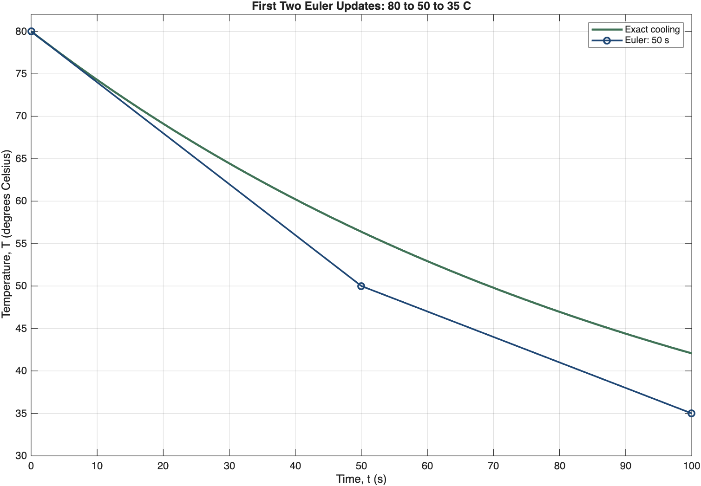
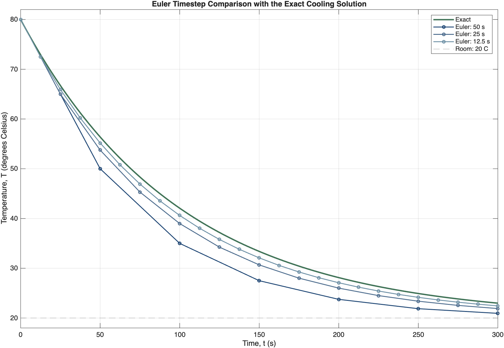

# Week 08 — Simulating Cooling with Euler's Method

Status: approved by the lecturer on 2026-09-05, including the strict reference-to-slide mapping. No slide images or PPTX have been generated.

Audience: Year-2 physics students with weak retained MATLAB literacy. Fourteen slides; three new Core ideas: state/rate with initial condition, the Euler update implemented in a loop, and timestep/reference validation. Teaching Courseware is prescribed by the project. No student-facing timings or slide numbers. All material is English.

## Locked scientific content

Uniform object temperature, constant surroundings, constant cooling time. Model: dT/dt = -(T-20)/100, with T in degrees Celsius and t in seconds; T(0)=80 degrees Celsius. Simulate to 300 s using steps 50, 25 and 12.5 s. Exact reference: T(t)=20+60 exp(-t/100). First two Euler updates with h=50 s: 80 -> 50 -> 35 degrees Celsius at 0, 50, 100 s. Six coarse intervals require seven stored values.

At 300 s, exact T=22.9872241021 C; Euler endpoints are 20.9375000000, 21.9005811214, 22.4341342258 C. Absolute errors are 2.0497241021, 1.0866429806, 0.5530898762 C. Display rounded values consistently; use absolute error in degrees Celsius, not percent of Celsius temperature. Coarse Euler cools too quickly for the supplied model and steps.

All numerical assets below are MATLAB reference-only inputs for a full-slide ImageGen redraw. They are strict scientific evidence, not style references and not raster overlays. Retain their scripts and CSV data under `../../matlab/`; compare the final redraw with these originals during QA.

## Slide 1 — Can a Cooling Rate Predict a Temperature?
- Warm object starts at 80 C in a room at 20 C.
- Predict whether equal time intervals produce equal temperature drops.
- Connect a rate rule to a sequence of future temperatures.
- Role: physical question; labelled object/room relationship with open canvas. No external source image required; conceptual illustration must show correct heat-flow direction.

## Slide 2 — Name the State, Rate, and Initial Condition
- T is the evolving temperature in degrees Celsius; t is time in seconds.
- dT/dt is temperature change per second; T(0)=80 C anchors the curve.
- Room temperature is fixed at 20 C; uniform-temperature assumption.
- Role: concept mapping with brief definitions near their physical targets. No required source image.

## Slide 3 — Read the Cooling Law in Words
- dT/dt = -(T-20)/100; cooling time tau=100 s.
- Greater temperature excess gives faster cooling; minus sign means a decrease.
- At 80 C the rate is -0.6 C/s; temperature-difference units are consistent.
- Role: equation-to-meaning explanation; no required source image.

## Slide 4 — Turn the Current Rate into One Step
- Next temperature = current temperature + timestep × current rate.
- T(n+1)=T(n)+h[-(T(n)-20)/100].
- Seconds × C/s produces a temperature change; the rate is frozen only over this step.
- Role: Euler construction using a short labelled update diagram. No required source image.

## Slide 5 — Trace Two Euler Updates
- At t=0: T=80 C, rate=-0.6 C/s; h=50 s gives T=50 C.
- Recalculate rate=-0.3 C/s; the next temperature is 35 C at 100 s.
- Euler markers differ from the exact curve; do not label these as exact temperatures.
- Role: worked numerical example beside graph; representative sample candidate.
- Required image: strict numerical reference, showing exact curve and first two Euler segments.
  

## Slide 6 — Plan the Algorithm Before MATLAB
- Choose parameters and times; reserve temperature values.
- Store the initial condition; repeat current-rate then next-value calculation.
- Plot, refine the timestep, and compare with the reference.
- Role: short pseudocode flow, with loop feedback arrow. No required source image.

## Slide 7 — Seven Values Represent Six Intervals
- `t_s = 0:50:300` contains seven times.
- `T_C = zeros(size(t_s)); T_C(1) = 80;` reserves values and sets the initial condition.
- MATLAB index 1 is time zero; index 7 is 300 s.
- Role: indexed array diagram, exact labels and code. No required source image.

## Slide 8 — Read the Euler Loop
- Loop from `n = 1:numel(t_s)-1`.
- `rate_Cps = -(T_C(n)-T_room_C)/tau_s;`
- `T_C(n+1) = T_C(n) + dt_s*rate_Cps;`
- Role: short code trace; ask which elements are read and written for n=2. Include `for` and `end` in complete snippet. No required source image.

## Slide 9 — Check the Trajectory Before Trusting It
- Initial value must be 80 C; the supplied run cools monotonically toward 20 C.
- Markers are computed values; lines only join them.
- A plausible physical trend alone does not establish numerical accuracy.
- Role: graph interpretation; use exact and 50 s series only from the supplied multi-run data.
- Required image: strict numerical reference; extract the scientific series through full ImageGen redraw, with no local crop or overlay.
  

## Slide 10 — Change the Timestep, Keep the Physics Fixed
- Compare 50, 25 and 12.5 s steps to the same final time of 300 s.
- Smaller steps update the rate sooner and approach the exact curve here.
- Changing tau would change the model; changing h changes the numerical resolution.
- Role: graph-led controlled comparison, keep all axes and units readable.
- Required image: strict numerical reference with all three Euler series and exact solution.
  

## Slide 11 — Measure Error Against a Supplied Reference
- Exact T(t)=20+60 exp(-t/100), hence T(300)=22.9872 C.
- Table: h=50,25,12.5 s; endpoints=20.9375,21.9006,22.4341 C.
- Absolute errors=2.0497,1.0866,0.5531 C; decreasing error supports refinement for these runs.
- Role: small evidence table; strict source `../../matlab/cooling_endpoint_evidence.csv`. No required image.

## Slide 12 — Spot a Runnable but Wrong Update
- Wrong expression: `T_C(n+1) = T_C(n) + rate_Cps;`.
- It adds temperature and temperature/time; restore `dt_s*rate_Cps`.
- Ask students to identify the missing factor before showing the correction.
- Role: code diagnosis, one clearly labelled defect; no required source image.

## Slide 13 — Predict a Slower Cooling Model
- Double tau from 100 to 200 s while holding the initial condition fixed.
- Initial rate magnitude halves; temperature remains higher at 300 s.
- Supplied exact changed endpoint is about 33.3878 C; a smaller timestep cannot fix a nonuniform-temperature assumption.
- Role: student verbal parameter modification and physical limitation; no required image. Supplied ode45 reading stays in the note/Live Script as Working exposure and is not an additional Core slide.

## Slide 14 — Explain One Update and One Check
- State the variable, rate unit, and initial condition.
- Trace the first Euler update with h=25 s (expected 65 C); explain why the rate is recomputed.
- Choose a physical check and explain why timestep/reference comparison adds evidence beyond a smooth graph.
- Role: exit ticket with compact response areas on an open canvas; no required source image. Presenter answers belong in notes after approval.

## Approved production boundary

The lecturer approved the fourteen-slide sequence, locked cooling model, and strict-reference mapping on 2026-09-05: first-step plot -> slide 5; trajectory plot -> slides 9 and 10; endpoint CSV -> slide 11. The prescribed Teaching Courseware style is the confirmed project visual direction. Proceed through built-in backend confirmation and one sample-slide review. Exact-match inherited slide workers are mandatory only after sample approval. No downstream production files have been created.
