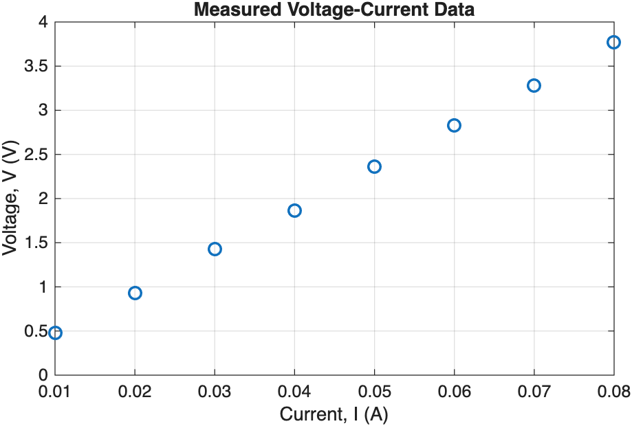
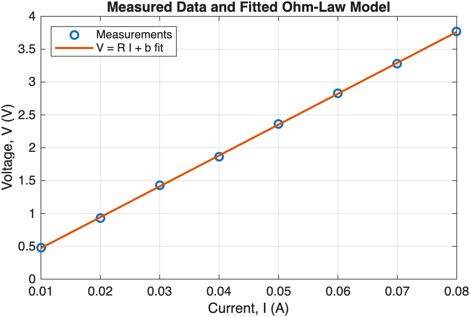
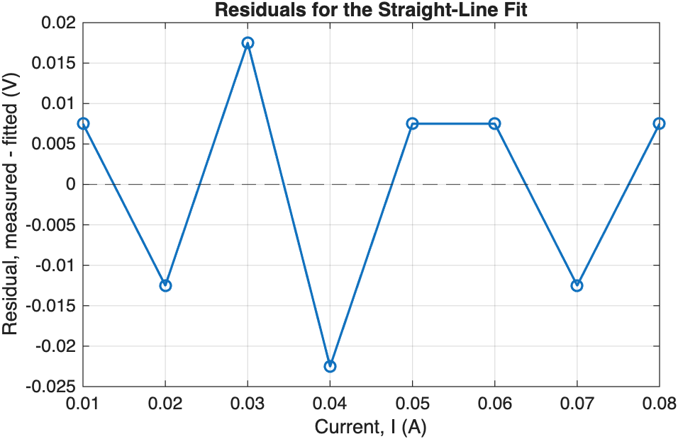

# Week 09 — Data Fitting: From Measurements to Physical Parameters

Status: draft prepared for lecturer review. No slide images, prompt jobs, speaker-note file, deck specification, run-state file, or PPTX have been created.

Audience: Year-2 physics students with weak retained MATLAB literacy. Fourteen slides; three new Core ideas: fit a supplied simple physical relationship, inspect residuals, and state fitted-parameter uncertainty cautiously. Teaching Courseware is prescribed by the project. No student-facing timings or slide numbers. All material is English.

## Locked scientific content

Lecture context: voltage-current measurements for a nominal 47 ohm resistor. Proposed relationship `V = R I + b`, where `I` is in A, `V` and `b` are in V, and fitted slope `R` has unit V/A = ohm. Locked data: `I_A = [0.01 0.02 0.03 0.04 0.05 0.06 0.07 0.08]`; `V_V = [0.48 0.93 1.43 1.86 2.36 2.83 3.28 3.77]`. Base-MATLAB straight-line fit gives `R = 47.0000 ohm`, `b = 0.0025 V`. Residual RMSE is `0.0129904 V`; largest absolute residual is `0.0225 V`.

Physical/reference validation: nominal resistor `47 ohm` with `5%` tolerance gives `44.65–49.35 ohm`; the fit lies inside this range. This tolerance is not the fit uncertainty. Supplied repeat runs produce slopes `47.0000`, `47.0595`, and `47.2738 ohm`; use the observed `47.0–47.3 ohm` span as a simple repeatability range, explicitly not a formal confidence interval.

The MATLAB graph assets referenced below are strict numerical/reference inputs for any future slide generation. They are not style references and must later be redrawn as part of a complete ImageGen slide under the course contract, with the generated graph checked against these retained MATLAB sources. No such redraw is authorized in the current task.

## Slide 1 — Can Measurements Reveal a Resistance?
- Show several voltage-current measurements for a nominal 47 ohm resistor.
- Ask whether one noisy point or the overall trend should determine the resistance estimate.
- Predict a positive slope of roughly 47 V/A.
- Role: physical question and prediction; open canvas with simple resistor/measurement context. No required source image.

## Slide 2 — Separate Measurements From Fitted Parameters
- Measured quantities: current `I` in A and voltage `V` in V.
- Fitted parameters: resistance `R` in ohm and intercept `b` in V.
- A parameter is inferred from the pattern across the dataset rather than read from one row.
- Role: concept mapping; visually distinguish data columns from model parameters. No required source image.

## Slide 3 — Read the Proposed Relationship in Words
- Model: `V = R I + b`.
- Slope unit `V/A = ohm`; intercept unit `V`.
- `b` allows a small measurement zero offset; the fit does not prove the resistor is ideal under every condition.
- Role: equation-to-meaning explanation. Exact equation must later be a strict source input; no required source image now.

## Slide 4 — Plot the Raw Data Before Fitting
- Eight measured pairs span `0.01–0.08 A` and `0.48–3.77 V`.
- A roughly straight rising trend supports trying a linear relationship.
- Plotting first can reveal curvature, outliers, or unit mistakes before a fitting command hides them.
- Role: data evidence.
- Required image: strict MATLAB reference plot of the raw measurements.
  

## Slide 5 — Plan the Fit Before MATLAB
- Plot measurements and state the model with units.
- Fit slope/intercept; predict fitted voltage at measured currents.
- Calculate `residual = measured - fitted`.
- Validate the parameter and report uncertainty only to justified precision.
- Role: process/pseudocode flow. No required source image.

## Slide 6 — Read the Straight-Line Fitting Scaffold
- `p = polyfit(I_A,V_V,1);`
- `R_fit_ohm = p(1); offset_fit_V = p(2);`
- `V_fit_V = polyval(p,I_A);`
- Emphasise that the supplied scaffold uses all measurements; students are reading and modifying, not deriving least squares.
- Role: short code trace. Exact code must later be supplied as strict text source; no required source image.

## Slide 7 — Interpret the Slope and Intercept Physically
- Fitted slope `47.0000 V/A` means `R = 47.0000 ohm`.
- Fitted intercept `0.0025 V` is a small voltage offset.
- Distinguish the fitted resistance from any single measured current or voltage.
- Role: parameter interpretation with units. No required source image.

## Slide 8 — Overlay the Model and Measurements
- Show the eight measurement markers with the fitted straight line.
- The fit follows the overall trend while individual points sit slightly above or below it.
- A close-looking overlay is useful but does not replace residual inspection.
- Role: graph-led evidence; representative future sample-slide candidate.
- Required image: strict MATLAB fit reference.
  

## Slide 9 — Residual Means Measured Minus Fitted
- Define `r_i = V_measured - V_fit` in volts.
- Positive residual: measurement above the fitted line; negative residual: below it.
- Residuals expose model-data disagreement on the scale of the measured quantity.
- Role: concept mapping from one graph point to a signed residual. No required source image.

## Slide 10 — Inspect the Residual Pattern
- Supplied residuals alternate around zero with no obvious curvature.
- RMSE is about `0.0130 V`; largest absolute residual is `0.0225 V`.
- Small scatter supports the straight-line model over this range, without proving universal validity.
- Role: residual evidence and interpretation.
- Required image: strict MATLAB residual reference.
  

## Slide 11 — Validate Against the Nominal Component
- Nominal resistance `47 ohm`, tolerance `5%` -> `44.65–49.35 ohm`.
- Fitted `47.0000 ohm` lies inside the manufacturer range.
- Explain that tolerance is a component specification, not the uncertainty of the fitting procedure.
- Role: validation/reference check. No required source image.

## Slide 12 — Report Only the Uncertainty the Evidence Supports
- Supplied repeat fitted slopes: `47.00`, `47.06`, `47.27 ohm`.
- Observed repeatability span: roughly `47.0–47.3 ohm`.
- Suggested wording: resistance is about `47.1 ohm`, with repeat runs spanning `47.0–47.3 ohm`.
- State explicitly that this is not a formal confidence interval.
- Role: cautious uncertainty statement. No required source image.

## Slide 13 — A Pattern in Residuals Is a Warning
- Show a conceptual U-shaped residual pattern around zero.
- Explain that visible structure can indicate missing curvature, changing physics, calibration error, or another model limitation.
- Do not automatically delete points; investigate the model and measurement process.
- Role: model-quality diagnosis. Conceptual visual only; no exact numerical source required.

## Slide 14 — Explain One Fit and One Check
- Given `V = R I + b`, state the units of `R` and `b`.
- Explain what a positive residual means.
- Choose one independent check for the 47 ohm fit and distinguish it from the repeatability range.
- Role: exit ticket with compact response areas. Presenter answers belong in notes only after later approval.

## Production boundary

This task stops at the outline gate. The lecturer has not yet approved the Week 09 slide sequence or strict reference mapping. Do not create or select a visual style beyond the already prescribed Teaching Courseware system; do not confirm an image backend; do not generate a sample; and do not create `deck_spec.json`, `speech.md`, prompt jobs, run-state files, slide images, or a PPTX until the lecturer explicitly advances the deck workflow.
