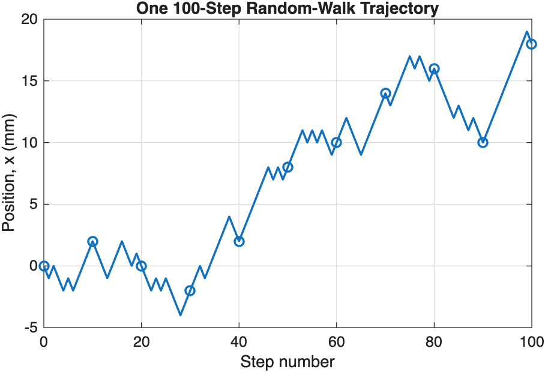
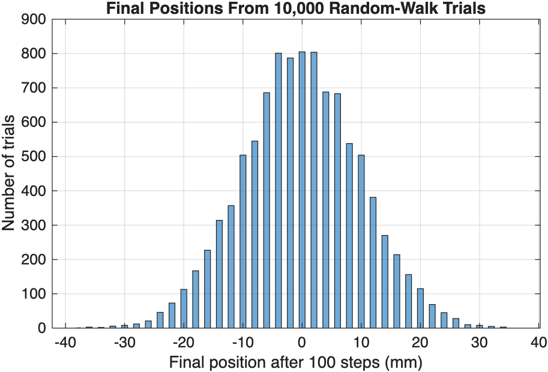
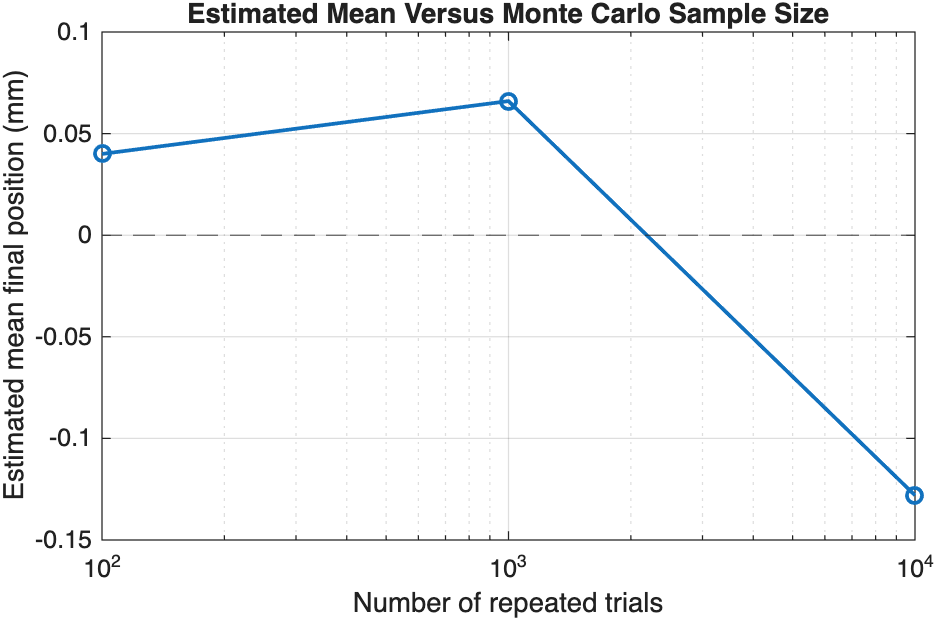

# Week 10 — Random Sampling and Monte Carlo: From Random Paths to Reliable Evidence

Status: draft prepared for lecturer review. No slide images, prompt jobs, speaker-note file, deck specification, run-state file, or PPTX have been created.

Audience: Year-2 physics students with weak retained MATLAB literacy. Fourteen slides; three new Core ideas: define and repeat a physical random trial, interpret mean/spread, and use sample-size plus reproducibility evidence to judge a Monte Carlo result. Teaching Courseware is prescribed by the project. No student-facing timings or slide numbers. All material is English.

## Locked scientific content

Lecture context: a one-dimensional symmetric diffusion-style random walk. One trial is one complete path of `N = 100` independent steps. The particle starts at `x = 0 mm`; every step has magnitude `a = 1 mm` and is equally likely to be `+1 mm` or `-1 mm`. Monte Carlo sample sizes are `M = 100`, `1000`, and `10000` repeated paths. The reproducible teaching seed is `rng(4605,'twister')`.

Locked MATLAB evidence from 10,000 trials: mean final position `-0.128 mm`; population-form spread `9.9423 mm`; ideal random-walk reference spread `a*sqrt(N) = 10 mm`. The nested sample-size summaries are: `M=100 -> mean 0.040 mm, spread 10.6320 mm`; `M=1000 -> mean 0.066 mm, spread 9.8122 mm`; `M=10000 -> mean -0.128 mm, spread 9.9423 mm`. Supplied standard-error values are about `1.0632`, `0.3103`, and `0.0994 mm` respectively. Standard error and `sqrt(N)` scaling remain Working exposure.

Core validation: symmetry predicts a long-run mean near `0 mm`; after exactly 100 steps of `±1 mm`, every final position must be an even integer number of millimetres. The locked simulation passes both checks. A fixed seed supports exact reruns but does not replace physical validation.

The MATLAB graph assets referenced below are strict numerical/reference inputs for any future slide generation. They are not style references and must later be redrawn as part of a complete ImageGen slide under the course contract, with the generated graph checked against these retained MATLAB sources. No such redraw is authorized in the current task.

## Slide 1 — Can Random Motion Produce a Stable Pattern?
- Introduce a particle receiving many equal left/right random kicks.
- Ask what can be predicted if no single 100-step trajectory is predictable.
- Prediction: many repeated paths should have an average final position near zero but nonzero spread.
- Visual idea: a clean left/right-kick particle sketch beside two student prediction cards: “centre?” and “spread?”.
- Role: physical question and prediction. No required source image.

## Slide 2 — Define One Random Trial Before Coding
- One trial = one complete 100-step path.
- Physical settings: start `x=0 mm`, step length `1 mm`, 100 steps.
- Repeated trials use the same physical rule but independent random draws.
- Visual idea: nested diagram, one 100-step path inside a larger set of repeated trials.
- Role: distinguish physical steps per trial from number of Monte Carlo trials. No required source image.

## Slide 3 — Read the Random-Step Rule in Physics Language
- Each step is either `+1 mm` or `-1 mm` with equal probability.
- No preferred direction means the long-run centre should be `0 mm`.
- Increasing steps per path changes the physical process; increasing trial count changes the amount of evidence.
- Visual idea: annotated `+1 mm` / `-1 mm` step arrows and a compact comparison of `N` versus `M`.
- Role: model/units mapping. No required source image.

## Slide 4 — Plan the Monte Carlo Experiment
- Choose physical parameters, trial count, and seed when exact reproducibility is needed.
- Generate random steps, accumulate one path, repeat the path, collect final positions.
- Calculate mean/spread, compare sample sizes, then validate against the model.
- Visual idea: six-stage flow from model parameters to validation, with one path icon becoming a distribution.
- Role: plain-language algorithm flow. No required source image.

## Slide 5 — Use a Seed for a Reproducible Random Sequence
- `rng(4605,'twister')` resets the generator to a known sequence.
- Same seed + same code gives the same finite-sample result; a different seed should give a different valid result.
- Seed is a computational reproducibility setting, not a physical model parameter.
- Visual idea: two identical seed-and-code inputs leading to matching results, contrasted with a different seed leading to a different valid sample.
- Role: reproducibility concept. Exact code must later be supplied as strict text source; no required source image.

## Slide 6 — Read the Random-Sampling Scaffold
- `random_draw = rand(n_steps,maximum_trials);`
- `step_direction = 2*(random_draw >= 0.5)-1;`
- `step_mm = step_length_mm*step_direction;`
- Trace how a uniform random draw becomes a physical `±1 mm` step.
- Visual idea: short strict-source code block with arrows from uniform draw to direction to physical step.
- Role: short code trace.
- Required source: `../../../Week10_Lecture_Demonstration_Random_Walk_Monte_Carlo.m`, lines 31-36; strict text input preserving identifiers, operators, and units.

## Slide 7 — One Trajectory Is One Possible History
- Show the locked first 100-step trajectory.
- Emphasise that another seed can produce a different path without invalidating the model.
- One path cannot determine the long-run mean or spread.
- Visual idea: the strict trajectory redraw with one path highlighted as “one possible history”, plus a small prompt: “is this enough evidence?”.
- Role: connect code to physical motion.
- Required image: strict MATLAB trajectory reference.
  

## Slide 8 — Repeat the Trial to Build a Distribution
- Repeat 10,000 independent 100-step paths.
- Final positions form a broad distribution centred near zero.
- Repeated randomness is evidence, not noise to be removed.
- Visual idea: the strict histogram redraw with a central near-zero marker and a short annotation about repeated paths.
- Role: distribution evidence.
- Required image: strict MATLAB histogram reference.
  

## Slide 9 — Mean and Spread Answer Different Questions
- Locked mean final position: `-0.128 mm`.
- Locked spread: `9.9423 mm`.
- Mean describes the centre; spread describes real trial-to-trial variation.
- Explain why a mean near zero does not imply every particle ends near zero.
- Visual idea: central mean marker over a broad endpoint strip, with a callout separating “centre” from “trial-to-trial spread”.
- Role: summary-statistic interpretation. No required source image.

## Slide 10 — More Trials Do Not Remove Physical Variability
- Compare `M = 100`, `1000`, `10000`.
- Means: `0.040`, `0.066`, `-0.128 mm`; spreads: `10.6320`, `9.8122`, `9.9423 mm`.
- The estimate changes with finite random samples, while the physical spread stays of the same order.
- Visual idea: compact three-row comparison table with a small trend annotation: “more evidence, not zero physical variation”.
- Role: sample-size table and interpretation. No required source image.

## Slide 11 — Monte Carlo Convergence Need Not Be Monotonic
- Plot estimated mean against trial count.
- The 1,000-trial mean is slightly farther from zero than the 100-trial mean, yet both are valid finite-sample outcomes.
- More trials generally stabilise an estimate; one sequence need not approach the reference monotonically.
- Visual idea: the strict sample-size graph redraw, with the non-monotonic 100-to-1,000 result clearly called out.
- Role: graph-led sample-size reasoning.
- Required image: strict MATLAB sample-size reference.
  

## Slide 12 — Validate With Symmetry and the Step Rule
- Symmetry check: long-run mean should be near `0 mm`; locked result passes.
- Step-rule check: after 100 steps of `±1 mm`, every final position must be an even integer millimetre; locked results pass.
- A plausible histogram or reproducible seed does not replace a physical check.
- Visual idea: two validation cards, one symmetry balance and one even-position number-line rule.
- Role: Core validation. No required source image.

## Slide 13 — Working Exposure: Precision and Random-Walk Scaling
- Supplied standard error of the mean: `spread/sqrt(M)`.
- Values fall from about `1.0632` to `0.0994 mm` as `M` rises from 100 to 10,000.
- Supplied ideal spread reference: `a*sqrt(N) = 10 mm`; simulated spread is `9.9423 mm`.
- Keep derivations out of Core; focus on interpretation.
- Visual idea: optional Working-exposure panel linking `spread/sqrt(M)` to the shrinking uncertainty of the estimated mean and `a*sqrt(N)` to the 10 mm reference.
- Role: Working exposure evidence. No required source image.

## Slide 14 — Explain One Trial, One Statistic, and One Check
- Define one trial for the random-walk model.
- Explain the difference between final-position mean and spread.
- State why two correct runs can differ and when a fixed seed is useful.
- Choose one independent validation check and explain what it tests.
- Visual idea: three open response cards for trial definition, statistic interpretation, and validation choice.
- Role: exit ticket with compact response areas. Presenter answers belong in notes only after later approval.

## Production boundary

This task stops at the outline gate. The lecturer has not yet approved the Week 10 slide sequence or strict reference mapping. Do not create or select a visual style beyond the already prescribed Teaching Courseware system; do not confirm an image backend; do not generate a sample; and do not create `deck_spec.json`, `speech.md`, prompt jobs, run-state files, slide images, or a PPTX until the lecturer explicitly advances the deck workflow.
