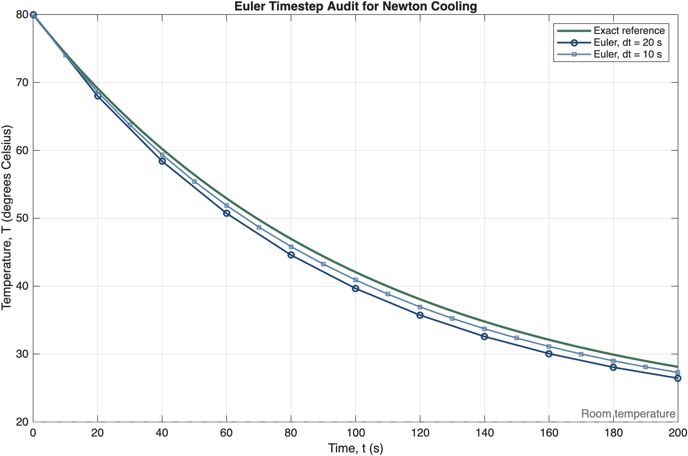

# Week 12 Lecture Outline — Integrated Method Selection and Capstone Studio

Status: outline and source mapping approved by the lecturer in the current task. No slide images, final deck specification, speech, prompt jobs, or PPTX have been created. This 14-slide lecture also provides the capstone-studio briefing; a duplicate practical deck is not proposed.

Core outcomes: match a familiar question to a learned method; trace and validate a supplied computation; assemble and defend a reproducible capstone result. No new numerical method. Week 12 studio is formative, not an additional graded portfolio packet or capstone milestone.

Locked worked model: Newton cooling, uniform object temperature, constant surroundings and time constant. `dT/dt = -(T-Tenv)/tau`; `Tenv=20 deg C`, `T0=80 deg C`, `tau=100 s`; `0 <= t <= 200 s`. Temperature differences have units K or deg C; rates are K/s or deg C/s. Euler steps `20 s` and `10 s`; supplied exact reference `T=20+60*exp(-t/100)`. The plus-sign update is a deliberately defective example, never the accepted model. Exact terminal temperature is approximately `28.1201 deg C`; Euler terminal temperatures approximately `26.4425 deg C` and `27.2946 deg C` respectively.

Source mapping: all equations, code, units, and values below are strict text facts. The lecture Live Script is the canonical code source. The MATLAB graph assigned to slide 9 is a strict numerical reference, supplied to ImageGen as reference only for a cohesive full-slide redraw. It must never be pasted or overlaid into the deck. No external scientific image is required. Exact equation/code reference renderings will be retained before sample generation when needed.

## Slide 1: Which Computation Answers the Physics Question?
- Key points: Week 12; begin with the required physical output; choose among methods already learned; finish with a defensible capstone result.
- Visual idea: physical question -> computation -> evidence, with a labelled output at each stage.
- Layout role: opening question and course synthesis.
- Required images: none.

## Slide 2: Name the Output Before Choosing the Method
- Key points: simultaneous circuit currents -> linear system; threshold crossing -> root; accumulated displacement from velocity samples -> integration; temperature evolution from a rate -> ODE stepping.
- Visual idea: four short familiar question/output/method rows, with supplied equations and units.
- Layout role: scaffolded method recognition.
- Required images: none; preserve the distinction between solving a threshold and computing an entire trajectory.

## Slide 3: Inputs, Output, and One Limitation
- Key points: cooling inputs are initial temperature, surroundings, time constant and times; output is temperature versus time; constant surroundings and uniform temperature are model assumptions; finite timestep is a numerical limitation.
- Visual idea: labelled cooling object and compact input/output map.
- Layout role: model and assumptions.
- Required images: none; conceptual object diagram, not quantitative experimental evidence.

## Slide 4: Predict the Cooling Before Running MATLAB
- Key points: initially hotter than surroundings; temperature should decrease toward 20 deg C; initial value must be 80 deg C; a rising curve would contradict this model.
- Visual idea: initial and later labelled states with heat-flow direction out of the hotter object.
- Layout role: prediction checkpoint.
- Required images: none.

## Slide 5: Connect the Rate to the Update
- Key points: rate is `-(T-Tenv)/tau`; divide a temperature difference by seconds; multiply rate by `dt`; add the change to the current temperature.
- Visual idea: equation-to-update mapping with units adjacent to each quantity.
- Layout role: model, scale and discretisation.
- Required images: none; strict equations and sign.

## Slide 6: Read the Algorithm Before the Code
- Key points: define parameters and time array; store initial temperature; repeat rate then update; compare the output with the supplied reference; explain discrepancy and physical meaning.
- Visual idea: five-step flow with the repeated step clearly bounded.
- Layout role: algorithm map.
- Required images: none.

## Slide 7: Trace One Euler Step
- Key points: `T(1)=80`; `dt=20`; first rate `-(80-20)/100=-0.6 deg C/s`; change `-12 deg C`; `T(2)=68 deg C` at `t=20 s`.
- Visual idea: short MATLAB loop beside an index/time/value table; remind that array index 1 represents time zero.
- Layout role: guided code tracing.
- Required source: `../../../Week12_Lecture_Demonstration_Integrated_Method_Selection.m`; strict code text preserving operators and indexing.

## Slide 8: A Script Can Run and Still Be Wrong
- Key points: defective `Tnext = T + dt*(T-Tenv)/tau` gives `92 deg C` on the first step; the sign contradicts cooling; replace plus contribution with the negative rate; rerun and check instead of trusting an AI explanation.
- Visual idea: defect and repair with one sign highlighted, followed by one physical consequence.
- Layout role: audit and bounded repair.
- Required images: none; defective code explicitly labelled, corrected code explicitly labelled.

## Slide 9: Validate Against the Supplied Reference
- Key points: exact `T(200)=28.1201 deg C`; Euler `dt=20 s` gives `26.4425 deg C`; `dt=10 s` gives `27.2946 deg C`; the finer step is closer for this case; agreement checks the numerical implementation, not all real-world assumptions.
- Visual idea: fully labelled temperature-versus-time plot with exact and both Euler series plus a small endpoint comparison.
- Layout role: quantitative evidence and validation.
- Required image (strict numerical reference only, full-slide ImageGen redraw):
  
- Reference role: preserve time range, temperature range, units, initial point, series ordering, endpoint values and curve shapes. Source graph exists and passed a fresh MATLAB process and visual QA; underlying curve and endpoint CSVs are retained in the same source folder.

## Slide 10: Choose a Check That Tests the Claim
- Key points: initial condition tests setup; reference comparison tests numerical output; timestep refinement checks sensitivity to discretisation; units alone cannot detect every sign defect; choose a check and explain what it can and cannot establish.
- Visual idea: supplied menu of check/claim pairs, with one guided student choice.
- Layout role: validation reasoning.
- Required images: none.

## Slide 11: Change One Parameter and Explain the Physics
- Key points: propose `tau=150 s` while holding other physical inputs fixed; predict slower cooling; rerun the supplied scaffold; compare with its corresponding exact reference; distinguish physical parameter change from changing timestep.
- Visual idea: controlled-change table and verbal prediction prompt, without invented computed output.
- Layout role: student modification and interpretation.
- Required images: none; any later numerical curve requires a retained MATLAB reference first.

## Slide 12: Assemble the Capstone Evidence
- Key points: use the already approved problem and starter; state model/units and pseudocode; show one justified modification and principal output; include required plus chosen validation; explain one physical conclusion and limitation.
- Visual idea: concise evidence checklist linked to the reasoning chain.
- Layout role: capstone-studio briefing.
- Required images: none; no new problem selection, numerical method or graded milestone.

## Slide 13: Reproduce and Rehearse the Defence
- Key points: rerun from a fresh MATLAB session with all dependencies; record release, parameters and numerical settings; record accepted/modified/rejected AI assistance and checks; each member traces a code section and explains physics; use Classroom for the formative checkpoint and Week 13 handoff.
- Visual idea: reproducibility handoff beside short defence prompts.
- Layout role: process and accountability.
- Required images: none. No confidential assessment answers or full chat-history demand.

## Slide 14: What Makes Your Result Trustworthy?
- Key points: identify one method from its required output; identify a code step and one validation result; state the capstone item still needing attention; next step is completion and individual defence in Week 13.
- Visual idea: three concise exit-ticket prompts on an open canvas.
- Layout role: exit ticket and forward connection.
- Required images: none.

## Approval and Production Record

- Outline and slide-to-source mapping: approved; user stated "The outline is approved."
- Style: Teaching Courseware, explicitly prescribed in the user-supplied course instructions.
- Backend: built-in ImageGen, explicitly prescribed in the user-supplied course instructions; callable tool verified.
- Proposed representative sample after those gates: slide 9, because it tests scientific graph fidelity, numerical values, and teaching density.
- Representative sample slide 9 was approved by the user with: "Okay, approved, finish the slide deck for week 12." Full generation then used exact-match slide-worker inheritance recorded by the coordinator; all 14 slides were inspected and assembled with presenter notes.
